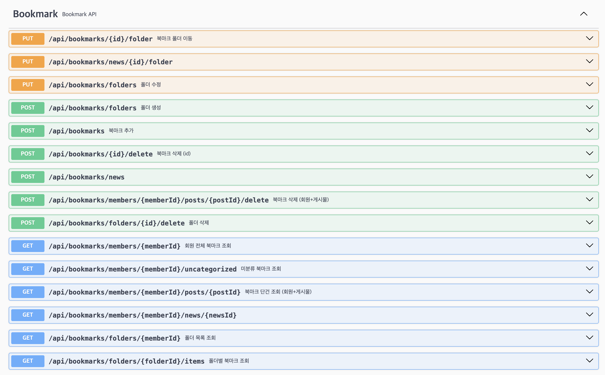
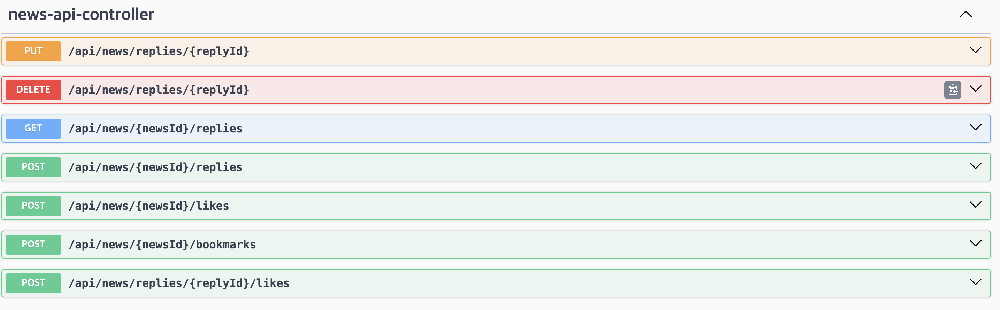
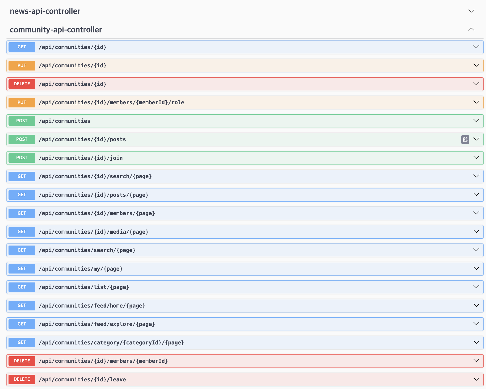
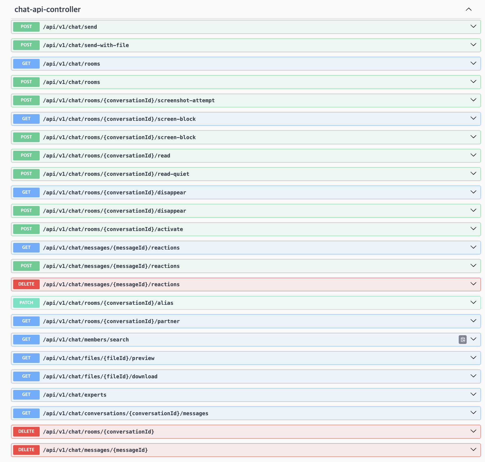

# 담당 업무 소개

무역 및 비즈니스 네트워킹 플랫폼 **GlobalGates** 프로젝트에서 제가 맡은 기능들을 소개합니다.

 

## 🔖 북마크 (Bookmark)

REST API를 활용해 사용자가 북마크한 게시물들을 메인 페이지에 불러옵니다.  
별도의 분류 없이 북마크할 경우 **미분류 북마크**로 자동 저장되며, 사용자가 새로운 북마크 폴더를 생성한 뒤 해당 폴더를 선택하면 게시물이 지정된 폴더로 분류되어 저장됩니다.

**주요 특징**
- REST API 기반 게시물 불러오기
- 미분류 / 사용자 정의 폴더로 자동 분류
- 메인 페이지에서 한눈에 확인 가능

  

 

## 📰 뉴스 (News)

**탐색하기** 페이지의 뉴스 탭과 페이지 하단 **푸터의 뉴스 영역**에서 최신 뉴스를 노출합니다.  
뉴스 항목을 클릭하면 뉴스 상세 페이지로 이동하며, 일반 뉴스 콘텐츠가 표시됩니다.

**주요 특징**
- 탐색하기 페이지 + 푸터 영역에 동시 노출
- 클릭 시 뉴스 상세 페이지로 이동
- 무역 관련 일반 뉴스 제공

  

 

## 👥 커뮤니티 (Community)

무역 사업자들이 자신의 관심 품목이나 카테고리별로 **커뮤니티를 직접 생성**할 수 있습니다.  
사용자들은 해당 커뮤니티 내에서 게시물을 작성하고, 대화를 나누며, 무역 관련 정보를 자유롭게 공유할 수 있습니다.

**주요 특징**
- 관심 품목 · 카테고리별 커뮤니티 생성
- 게시물 작성을 통한 정보 공유
- 사업자 간 자유로운 소통 환경 제공

  

 

## 💬 채팅 (Chat)

전문가와 개인 사업자 간의 소통을 매개하는 채널로, **메일의 무거운 접근성을 해소**하고 커뮤니티형 플랫폼의 성격에 맞춰 실시간 채팅 방식을 채택했습니다.  
채팅 내에서 사진 업로드 및 다운로드가 모두 가능하며, **AWS S3**를 활용하여 클라우드에 파일을 저장하고 불러오는 방식으로 파일을 관리합니다.

**주요 특징**
- 전문가 ↔ 개인 사업자 간 실시간 소통
- 메일 대비 가벼운 접근성 제공
- AWS S3 기반 사진 업로드 / 다운로드
- 클라우드 파일 관리

  

 

---

> 📁 **이미지 경로 안내**  
> 스크린샷은 프로젝트 루트의 `./images/` 폴더에 아래 파일명으로 저장하시면 자동으로 표시됩니다.  
> `bookmark.png` · `news.png` · `community.png` · `chat.png`
